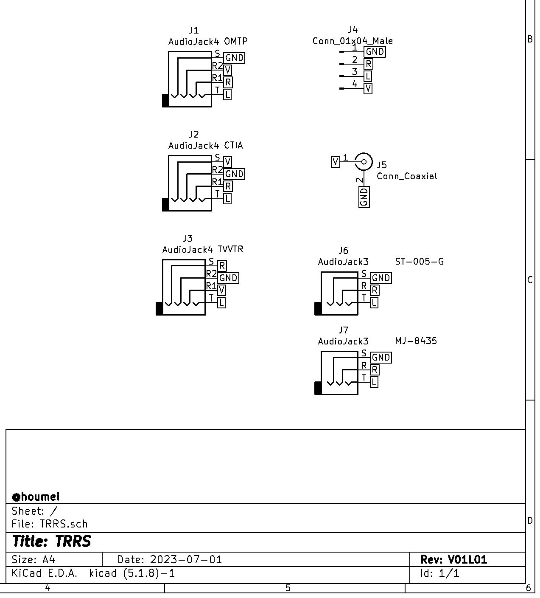

# TRRS 3.5mm 4pole plug converter (KiCad5)

Schematic

PCB

部品表  

J1-J3 [３．５ｍｍ４極ミニジャック　基板取付用　ＭＪ－４ＰＰ－９](https://akizukidenshi.com/catalog/g/gC-06070/)  
J4 [ピンヘッダ　１×４　（４Ｐ）　（１０個入）](https://akizukidenshi.com/catalog/g/gC-03950/) など ※オプション  
J1 [基板用RCAジャック 黄 RJ-2410](https://akizukidenshi.com/catalog/g/gC-06508/)  
J5 [基板用RCAジャック 白 MJ-523](https://akizukidenshi.com/catalog/g/gC-16497/)  
または [基板用RCAジャック 黒 RJ-2410](https://akizukidenshi.com/catalog/g/gC-16500/)  
J6 [３．５ｍｍ小型ステレオミニジャック　基板取付用](https://akizukidenshi.com/catalog/g/gC-02460/)  
J7 [３．５ｍｍステレオミニジャック　基板取付用　ＭＪ－８４３５](https://akizukidenshi.com/catalog/g/gC-09060/)  
※J6,J7はどちらかひとつでよい　　

## 説明

<!-- [DIN8RJ45V01L04 デジタルRGBをVGA RJ45コネクタに変換](http://blog.livedoor.jp/hardyboy/archives/10203256.html "まごころせいじつ堂")   -->
<!-- [SORD m5用ROM/RAMカートリッジ基板](https://keisanki.booth.pm/items/3939000 "booth")  -->

## 履歴
V01L01 初版  

## TRRSV01L01GB - Gerber
JLCPCBなどにそのまま出図可能です。  
